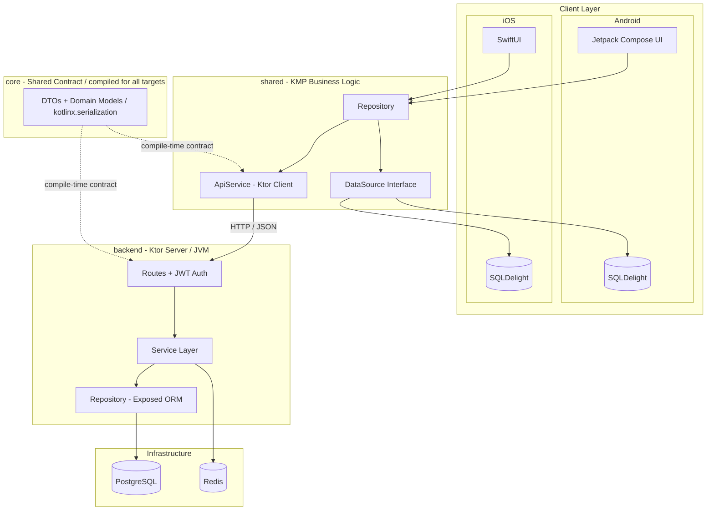
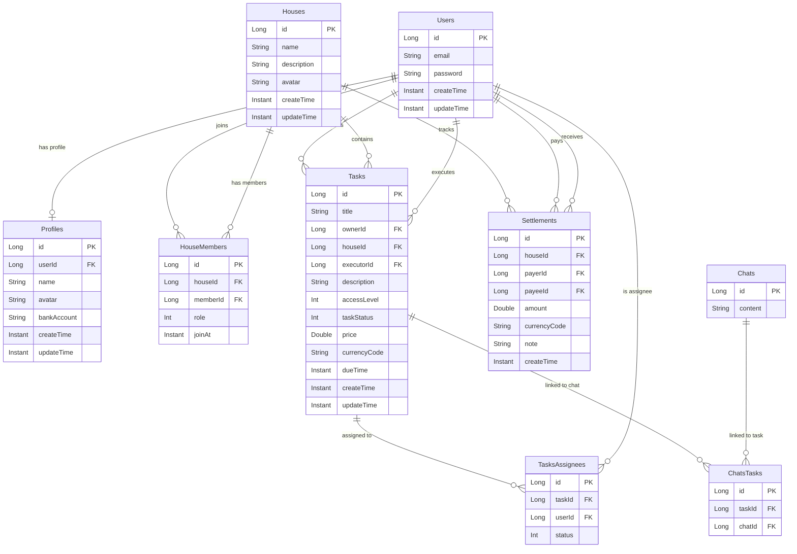

# JustWoo — Household Task Distribution App

Think of it as **Jira for your household** — assign chores to roommates, track who owes what, and settle up when it's payday.

A **full-stack Kotlin Multiplatform** application for household task management — covering the full engineering stack from backend to native mobile clients.

| 🖥️ Backend | 📱 Native Clients |
|:---|:---|
| 🔐 JWT auth + Bcrypt password hashing | 🤖 Android — Jetpack Compose + SQLDelight |
| 🗄️ PostgreSQL via Exposed ORM + HikariCP | 🍎 iOS — SwiftUI + SQLDelight |
| ⚡ Redis for session tokens & rate limiting | 🔗 Shared KMP business logic across both |
| ☁️ Deployed on AWS Lightsail + Nginx SSL | 📦 Compile-time API contracts via `:core` module |
| 🔄 GitHub Actions CI/CD — test → merge → deploy | |

> **Status:** Actively under development. Backend and shared module are functional; mobile clients are in progress.

---

## Table of Contents

- [Tech Stack](#tech-stack)
- [Architecture Overview](#architecture-overview)
- [Technical Decisions](#technical-decisions)
- [Backend API](#backend-api)
- [Database Schema](#database-schema)
- [Getting Started](#getting-started)
- [CI/CD](#cicd)
- [Production Infrastructure](#production-infrastructure)
- [Claude Code Skills](#claude-code-skills)
- [Project Status](#project-status)

---

## Tech Stack

| Layer | Technology | Purpose |
|:---|:---|:---|
| **Language** | Kotlin 2.2 | Single language across backend, shared logic, and Android |
| **Backend Framework** | Ktor 3.3 + Netty | Async HTTP server with coroutine-native request handling |
| **Server ORM** | Exposed 0.61 | Type-safe SQL DSL for PostgreSQL |
| **Server Database** | PostgreSQL + HikariCP | Production persistence with connection pooling |
| **Caching / Sessions** | Redis (Jedis 5.1) | Refresh tokens, login attempt tracking |
| **Authentication** | Auth0 JWT + Bcrypt | Stateless auth with secure password hashing |
| **Shared Logic** | Kotlin Multiplatform | Business logic shared across Android, iOS, and JVM |
| **Serialization** | kotlinx.serialization 1.9 | Compile-time safe JSON for API contracts |
| **Networking (Client)** | Ktor Client | Platform-specific engines (OkHttp / Darwin) |
| **Android UI** | Jetpack Compose | Declarative UI |
| **Local DB (KMP)** | SQLDelight | Type-safe SQL with shared schema across Android and iOS |
| **iOS UI** | SwiftUI | Native Apple UI framework |
| **Dependency Injection** | Koin 4.1 | Multiplatform DI across server and client |
| **Concurrency** | Kotlin Coroutines 1.10 | Structured concurrency across all layers |
| **Containerization** | Jib 3.4 | Dockerized backend deployment |
| **CI/CD** | GitHub Actions | Automated test → merge → deploy pipeline |
| **Cloud Infra** | AWS Lightsail + Nginx | Ubuntu server with SSL reverse proxy |
| **Testing** | JUnit + TestContainers + MockK | Integration tests with real PostgreSQL containers |

---

## Architecture Overview



### Module Breakdown

| Module | Role |
|:---|:---|
| **`:core`** | Shared DTOs and domain models, compiled for all targets. Acts as the API contract between server and clients — a field change breaks compilation on both sides, preventing runtime mismatches. |
| **`:shared`** | Platform-agnostic business logic. Defines `DataSource` interfaces for local persistence and `Repository` implementations that coordinate between network and local storage. Each platform provides its own `DataSource` implementation using native database solutions. |
| **`:backend`** | Ktor server with layered architecture: routes handle HTTP, services encapsulate business rules, repositories manage data access via Exposed ORM against PostgreSQL. Redis handles session tokens and login attempt rate limiting. |

---

## Technical Decisions

### Contract-Driven Full-Stack Type Safety

The `:core` module is compiled for JVM, Android, and iOS. DTOs defined here are serialized with `kotlinx.serialization` on both server and client. This eliminates manual JSON mapping and guarantees that API contract changes are caught at compile time — not in production.

### DataSource Abstraction for Native Persistence

Local storage interfaces are defined in `shared/commonMain` and implemented per platform with native solutions:

- **Android**: SQLDelight — type-safe SQL with generated Kotlin APIs
- **iOS**: SQLDelight — same shared schema, with generated Swift-compatible APIs

This approach provides the benefits of shared business logic and a single source of truth for the database schema across both platforms.

### Repository Pattern with Sealed Result Types

Repositories in the shared module coordinate between `ApiService` (remote) and `DataSource` (local), exposing results through sealed classes (`ApiResult<T>`, `AuthDataResult`, `HouseDataResult`). This gives callers exhaustive `when` handling for loading, success, and typed failure states — no unchecked exceptions leaking across layers.

### Backend Security Design

- **JWT authentication** with 1-hour access tokens and Redis-backed refresh tokens (7-day TTL)
- **Bcrypt password hashing** — passwords never stored in plaintext
- **Login attempt rate limiting** via Redis with 24-hour sliding window (max 10 attempts)
- **Layered authorization** — routes delegate auth checks to services, not embedded in HTTP handlers

---

## Backend API

| Endpoint | Method | Description |
|:---|:---|:---|
| `/auth/register` | POST | User registration with Bcrypt-hashed password |
| `/auth/login` | POST | Login with rate limiting, returns JWT + refresh token |
| `/auth/refresh` | POST | Rotate refresh token |
| `/houses` | GET/POST | House CRUD with pagination |
| `/houses/{id}/members` | POST | Member management with role-based access (ADMIN/MEMBER) |
| `/houses/{id}/tasks` | GET/POST | Task creation and assignment (optional price + ISO 4217 currency) |
| `/houses/{id}/settlements` | GET/POST | Record a payment between house members |
| `/houses/{id}/settlements/balance` | GET | Outstanding balance per member (with currency conversion) |
| `/profiles` | GET/PUT | Profile management |
| `/schema` | GET | Interactive Mermaid ER diagram of the database |

---

## Database Schema

Interactive ER diagram: [`https://justwoo-tw.uk/schema`](https://justwoo-tw.uk/schema)



Key design choices:
- **Junction tables** (`HouseMembers`, `TasksAssignees`, `ChatsTasks`) for many-to-many relationships
- **Role-based membership** — `HouseMembers` includes a `MemberRole` (ADMIN / MEMBER)
- **Task lifecycle** — status tracking with `TaskStatus` and `AccessLevel` enums
- **Optional pricing** — tasks support an optional `price` with ISO 4217 `currencyCode`
- **Settlement ledger** — `Settlements` tracks payments between members for cost reconciliation

---

## Getting Started

### Prerequisites

- JDK 21+
- Docker & Docker Compose v2

### Option 1 — Docker Compose (recommended)

1. **Create a `.env` file** in the `backend/` directory:
   ```env
   KTOR_ENV=production
   DB_HOST=db
   DB_PORT=5432
   DB_NAME=justwoo
   DB_USER=your_db_user
   DB_PASSWORD=your_db_password
   JWT_SECRET=your_jwt_secret
   JWT_AUDIENCE=justwoo-users
   REDIS_HOST=redis
   ```

2. **Build the fat JAR and start all services:**
   ```bash
   ./gradlew :backend:buildFatJar
   cd backend
   docker compose up --build -d
   ```

   | Service | URL |
   |:---|:---|
   | Backend API | `http://localhost:8080` |
   | Swagger UI | `http://localhost:8080/swagger` |
   | Portainer (Docker UI) | `http://localhost:9000` |

   PostgreSQL and Redis data are persisted in named Docker volumes.

### Option 2 — Run locally

Ensure PostgreSQL and Redis are running, then:

```bash
export DB_HOST=localhost DB_PORT=5432 DB_NAME=justwoo DB_USER=... DB_PASSWORD=...
export JWT_SECRET=... REDIS_HOST=localhost
./gradlew :backend:run
```

The server starts on port `8000`. Swagger UI is available at `http://localhost:8000/swagger`.

---

## CI/CD

Hosted on **AWS Lightsail** with a GitHub Actions pipeline.

### Branch Strategy

```
feature/xxx  →  develop  →  main  →  production
```

- Every issue gets its own `feature/*` branch
- Merge to `develop` triggers the CI pipeline
- If all tests pass, `develop` is automatically merged into `main` and deployed

### Pipeline

```yaml
push to develop
  └─ Run Unit Tests
       ├─ FAIL → upload test report artifact, stop
       └─ PASS → Merge develop → main
                   └─ Build fat JAR
                   └─ SCP to server
                   └─ docker-compose build + up
```

### Secrets required

| Secret | Description |
|:---|:---|
| `SSH_HOST` | Server public IP |
| `SSH_USER` | SSH login user (e.g. `ubuntu`) |
| `SSH_PRIVATE_KEY` | PEM private key content |
| `SSH_PORT` | SSH port (usually `22`) |

---

## Production Infrastructure

| Component | Solution |
|:---|:---|
| Server | AWS Lightsail (Ubuntu) |
| Reverse proxy | Nginx with Let's Encrypt SSL |
| Container runtime | Docker Compose v2 |
| Database | PostgreSQL 15 (Docker volume) |
| Cache / Sessions | Redis 7 (Docker volume) |
| Container UI | Portainer CE (SSH tunnel access only) |
| Domain | `https://justwoo-tw.uk` |
| API Docs | `https://justwoo-tw.uk/swagger` |

### Viewing logs (Portainer)

```bash
# Open SSH tunnel on your local machine
ssh -L 9000:localhost:9000 -i ~/.ssh/your-key.pem ubuntu@your-server-ip

# Then open in browser
http://localhost:9000
```

---

## Claude Code Skills

This repo ships with a `.claude/skills/` directory that codifies the project's conventions for AI coding assistants. The full set of non-negotiable rules — TDD by default, Swagger as the API contract, money as ISO 4217 string, sealed result types — lives in [`CLAUDE.md`](CLAUDE.md). Each skill below extends that baseline for its scope. Skills auto-trigger by file path (`paths:` frontmatter) so only the relevant rules load into context.

### Worker — best-practice rules per platform

Defines the engineering shape of each module. Loads when you edit files under that scope.

| Skill | Scope | Auto-triggers on |
|:---|:---|:---|
| `backend-best-practice` | Ktor + Exposed + Postgres + Redis, layered routes/service/repository, Swagger mandatory | `backend/src/**/*.kt`, `openapi/**` |
| `aos-best-practice` | Android non-Composable code — Components, ViewModels, Koin, coroutines | `androidApp/**/*.kt` |
| `ios-best-practice` | SwiftUI bound to Decompose Components, Keychain, ISO 4217 display | `iosApp/**`, `shared/src/iosMain/**` |
| `kmp-best-practice` | `:core` cross-stack contract, `shared/commonMain` UseCases, `expect`/`actual` discipline | `shared/src/**`, `core/**` |
| `compose-authoring` | One `@Composable` per file, mandatory `@Preview`, state hoisting, design tokens | `androidApp/**/ui/**/*.kt` |
| `decompose-nav` | Component + Content pattern, `@Serializable` configs, no `NavController` | `**/ui/nav/**`, `*Component.kt` |

### Feature context — domain invariants

Pins the business rules that must survive any refactor in that domain.

| Skill | Invariants enforced |
|:---|:---|
| `feature-auth` | Bcrypt only, JWT 1h + Redis refresh 7d, rate-limited login, generic auth errors (no email enumeration) |
| `feature-house` | `ADMIN` / `MEMBER` roles, last-admin protection, invite codes single-use + TTL, no cross-house data leakage |
| `feature-task` | House-scoped, owner/executor/assignee role split, status state machine, optional `price` + mandatory `currencyCode` when present |
| `feature-settlement` | Immutable ledger, `payerId ≠ payeeId`, multi-currency balance via `BigDecimal`, decoupled from `Task` |

### Agent — runs in a forked subagent

Skills with `context: fork` execute in an isolated subagent and return a concise report, keeping the main conversation clean.

| Skill | Purpose |
|:---|:---|
| `build-verifier` | Picks gradle targets from `git diff` (or an explicit arg), runs compile + tests, returns pass/fail with the first error block per target. Use after non-trivial edits, before declaring done. |

### How they fit together

When you edit `backend/.../service/SettlementService.kt`, `backend-best-practice` and `feature-settlement` both auto-load — the worker skill enforces layering and TDD flow, the feature skill enforces the domain invariants. Once the change is in place, invoke `/build-verifier` (or let Claude trigger it) to confirm the targets compile and tests pass.

---

## Project Status

- [x] Backend: Auth, House, Task, Profile, Settlement services with full CRUD
- [x] Core: Shared DTOs and domain models across all targets (currency as ISO 4217 string)
- [x] Shared: Repository pattern, API client, DataSource interfaces
- [x] CI/CD: GitHub Actions — test → auto-merge → deploy
- [x] Production: AWS Lightsail + Nginx SSL + Docker Compose
- [x] Android: Decompose navigation setup
- [ ] Android: Compose UI (in progress)
- [ ] iOS: SwiftUI + SQLDelight DataSource implementation

---

**Pin-Yun (Pollyanna) Wu** — [LinkedIn](https://www.linkedin.com/in/pin-yun-wu/)
